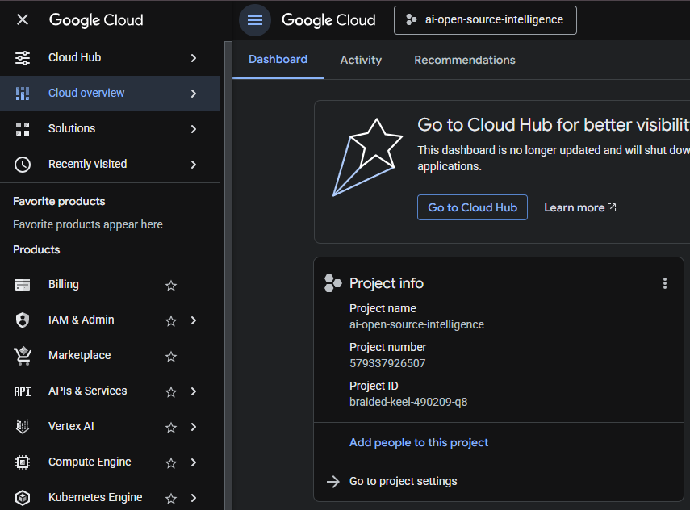
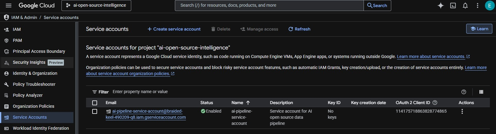
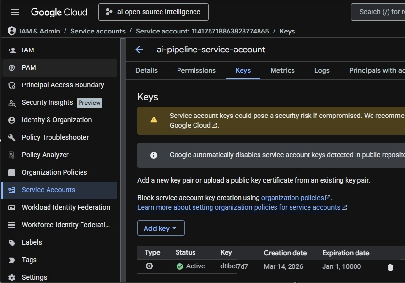
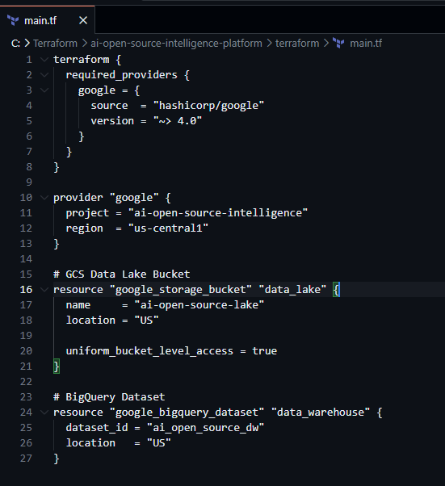
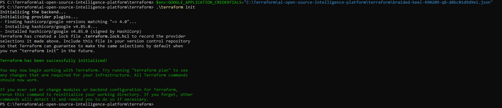
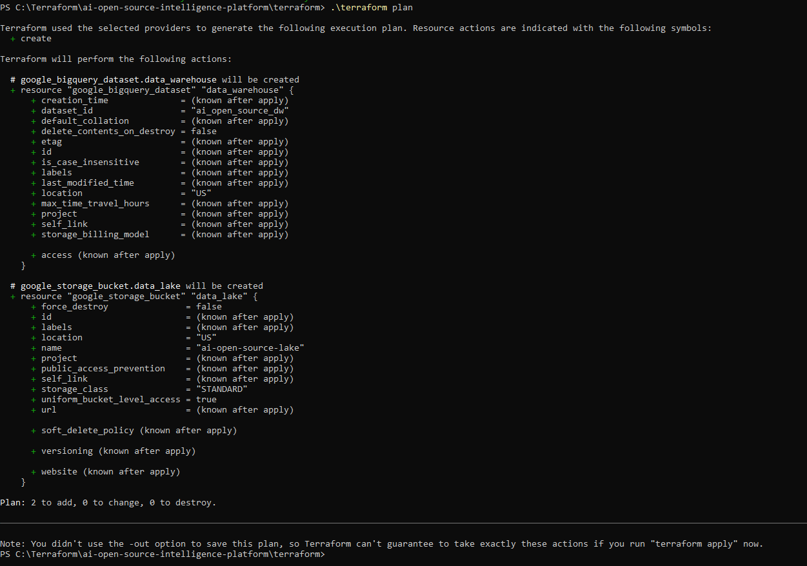
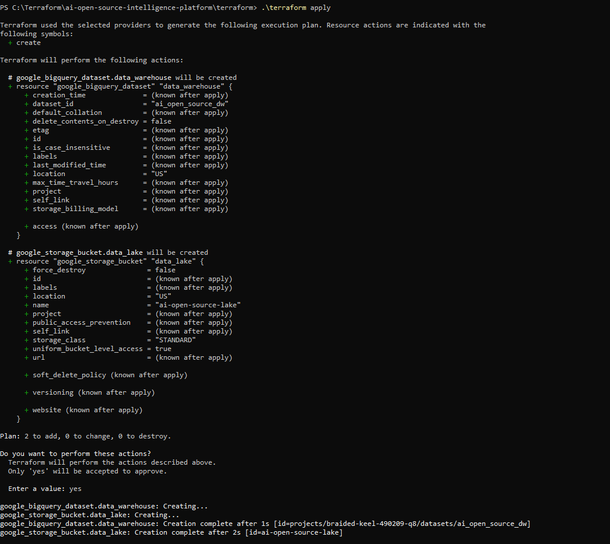
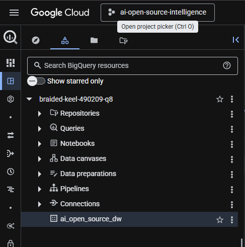
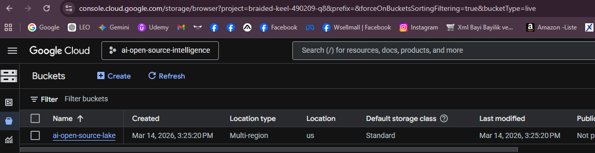

### Step 1 — Google Cloud Environment Setup

In the first step of the project, I set up the cloud environment on **Google Cloud Platform (GCP)** to support the data engineering pipeline.

I created a dedicated GCP project to host all infrastructure components required for the pipeline. My Project Name is : ai-open-source-intelligence



Within this project, I enabled the core services needed for data storage, processing, and access management.

The following services were activated:

* **BigQuery**, which serves as the data warehouse for analytical queries and large-scale data processing
* **Google Cloud Storage (GCS)**, which acts as the data lake layer for storing raw and intermediate data
* **Identity and Access Management (IAM)**, which is used to securely manage permissions and access control across the project

To allow the pipeline components to securely interact with Google Cloud services, I created a **service account** and assigned the necessary roles, including BigQuery and Cloud Storage administrative permissions.



I generated a key for the Service Account, downloaded the json.key file, and placed it in the C:\Terraform\ai-open-source-intelligence-platform\terraform folder that I created for my project.



This initial setup established the cloud foundation required for building and running the end-to-end data pipeline.

### Step 2 — Infrastructure Provisioning with Terraform

In the second step of the project, I provisioned the core cloud infrastructure using **Terraform** in order to automate the creation of the resources required for the data pipeline.

Using Infrastructure as Code (IaC), I defined the infrastructure components in Terraform configuration files and deployed them programmatically to Google Cloud Platform.

First, I configured the **Google Cloud provider** within Terraform and connected it to my GCP project using a service account credential. This allowed Terraform to securely interact with Google Cloud services.



Next, I initialized the Terraform working directory to download the required provider plugins and prepare the environment for infrastructure deployment.

```bash id="tfinit"
terraform init
```



After initialization, I executed a Terraform plan to preview the infrastructure resources that would be created.

```bash id="tfplan"
terraform plan
```



Once the configuration was verified, I applied the Terraform configuration to provision the infrastructure in Google Cloud.

```bash id="tfapply"
terraform apply
```



Through this process, I automatically created the following infrastructure components:

* A **Google Cloud Storage (GCS) bucket** to serve as the **Data Lake layer** for storing raw repository data.
* A **BigQuery dataset** to act as the **Data Warehouse layer** for storing structured and transformed analytical tables.




By using Terraform, the infrastructure setup becomes **fully reproducible and version-controlled**, ensuring that the entire cloud environment can be recreated consistently across different environments.

           
