# Global AI Open-Source Intelligence Platform : A Global Data Engineering Pipeline  - Solution with Kestra

### Mapping the Evolution of Artificial Intelligence Across the World

**Author:**
Esila Nur Demirci

## Problem Statement

The open-source ecosystem has become one of the most important drivers of innovation in Artificial Intelligence. Thousands of developers around the world contribute to repositories related to Machine Learning, Deep Learning, Large Language Models (LLMs), and Artificial Intelligence. However, it is difficult to understand how this ecosystem evolves globally and which regions and technologies are leading the development of AI.

This project aims to analyze the global landscape of open-source AI development using large-scale GitHub repository data. By leveraging public datasets available in BigQuery, the project explores trends in AI-related repositories and investigates which AI domains are growing the fastest, which programming languages are most commonly used in AI projects.

Through an end-to-end data engineering pipeline, the project collects, processes, and transforms GitHub repository data to build an analytical dataset that supports interactive visualization and exploration.

The final outcome is a dashboard that provides insights into:

* The distribution of AI-related repositories across different domains (Machine Learning, Deep Learning, LLMs, and Artificial Intelligence)
* The programming languages most frequently used in AI projects

By transforming large-scale open-source data into meaningful insights, this project aims to provide a clearer view of how the global AI ecosystem is evolving and which technologies and regions are driving innovation.

## Architecture

This project builds an end-to-end data engineering pipeline to analyze the global open-source Artificial Intelligence ecosystem using large-scale GitHub repository data.

```mermaid
flowchart LR

A[BigQuery Public Dataset<br>GitHub Repositories]

A --> B[Kestra Pipeline Orchestration]

B --> C[Data Extraction<br>AI Repository Detection]

C --> D[GCS Data Lake<br>Parquet Raw Data]

D --> E[BigQuery Raw Dataset<br>Data Warehouse Layer]

E --> F[dbt Transformation Layer]

F --> G[Analytics Tables<br>AI Insights Dataset]

G --> H[Power BI Dashboard]

H --> I[AI Ecosystem Insights]

```
---

# Data Pipeline Explanation

This project implements an **end-to-end data engineering pipeline** designed to analyze the global evolution of Artificial Intelligence development within the open-source ecosystem. The pipeline processes large-scale GitHub repository data through multiple data layers and ultimately delivers analytical insights through an interactive dashboard.

The architecture follows a modern data platform approach consisting of **data ingestion, data lake storage, data warehousing, transformation, and visualization layers**.

---

## 1. Data Source

The pipeline uses the **GitHub Repositories Public Dataset** available in BigQuery.

This dataset contains extensive information about open-source repositories, including repository metadata, commits, files, and programming languages.

The dataset serves as the primary source for identifying repositories related to:

* Artificial Intelligence
* Machine Learning
* Deep Learning
* Large Language Models (LLMs)

By querying this dataset, the project extracts repositories relevant to AI-related technologies.

---

## 2. Data Extraction

The data extraction process is orchestrated using Kestra, which manages the execution of pipeline tasks in a structured workflow.

Within the Kestra pipeline, a BigQuery task executes SQL queries against the GitHub Public Dataset to extract repositories relevant to Artificial Intelligence.

The extraction logic identifies AI-related repositories by scanning repository metadata and descriptions for keywords such as:

 * machine learning

 * deep learning

 * large language models (LLM)

 * artificial intelligence

This automated extraction step ensures that the pipeline consistently retrieves the subset of repositories associated with AI technologies before storing the data in the data lake layer.

---

## 3. Data Lake

After the extraction step, the filtered repository dataset is exported to Google Cloud Storage (GCS) through the Kestra orchestration pipeline.

Within the pipeline, a dedicated task writes the extracted AI-related repository data into a cloud storage bucket, creating a data lake layer that stores the raw dataset before further processing.

This data lake layer serves several important purposes:

 * Reproducibility – the original extracted dataset is preserved and can be reprocessed if needed

 * Scalability – cloud storage enables efficient handling of large datasets

 * Data lineage – raw data remains available for auditing and debugging

The dataset is stored in a structured format inside the GCS bucket, allowing it to be easily loaded into the data warehouse layer in the next stage of the pipeline.

---

## 4. Data Warehouse Layer

After ingestion, the raw dataset is loaded into **BigQuery**, which acts as the central **data warehouse** of the project.

At this stage:

* Raw repository data is structured into warehouse tables
* Data becomes optimized for analytical queries
* Large-scale analysis can be performed efficiently

BigQuery enables fast processing of large datasets and serves as the core analytical engine for the pipeline.

---

## 5. Data Transformation

Data transformation is implemented using **dbt (Data Build Tool)**.

dbt transforms raw repository data into **analytics-ready tables** by applying modular SQL transformations.

The transformation layer focuses on:

* Identifying AI-related repositories
* Aggregating repository statistics
* Preparing structured datasets for analytical queries

These transformations generate curated datasets that power the analytical layer of the project.

---

## 6. Analytics Layer

The transformed datasets form an **AI ecosystem analytics layer**, which provides insights into several aspects of global AI development.

This layer enables analysis of:

* The distribution of AI repositories across different domains
* The geographic distribution of AI development activity
* The most commonly used programming languages in AI projects
* The growth of AI-related repositories over time

These analytics tables serve as the foundation for the visualization layer.

---

## 7. Visualization

The final stage of the pipeline connects the analytics tables stored in **BigQuery** to **Power BI**, where interactive dashboards are created.

The dashboard enables users to explore key insights related to the global open-source AI ecosystem, including:

* AI repository growth trends
* AI development activity by country and continent
* Programming language distribution in AI projects
* Category distribution across Machine Learning, Deep Learning, LLMs, and Artificial Intelligence

By combining large-scale open-source data with interactive visualization, the dashboard transforms complex repository data into **clear and accessible insights about the global evolution of Artificial Intelligence**.

---
## Tech Stack

This project leverages a modern data engineering stack to build a scalable end-to-end pipeline for analyzing the global open-source Artificial Intelligence ecosystem.

### Cloud Platform

**Google Cloud Platform (GCP)**
The project is deployed on GCP, providing scalable infrastructure and managed services for data processing and storage.

---

### Infrastructure as Code

**Terraform**
Terraform is used to provision and manage cloud infrastructure resources such as storage buckets and data warehouse components in a reproducible and automated way.

---

Workflow Execution

The execution of the data pipeline is orchestrated using Kestra, which manages the workflow as a sequence of automated tasks.

Within the Kestra pipeline, each stage of the data processing workflow is executed as an independent task with clearly defined dependencies. This ensures that the pipeline runs in a consistent, reproducible, and automated manner.

The workflow consists of the following steps:

 * Extracting AI-related repository data from the BigQuery public dataset using SQL queries executed within the Kestra pipeline

 * Exporting the filtered dataset to Google Cloud Storage (GCS) to create a raw data layer in the data lake

 * Loading the extracted dataset into BigQuery warehouse tables to prepare the data for analytical processing

 * Running dbt models to transform raw repository data into structured analytics-ready datasets

By orchestrating these steps through Kestra, the pipeline ensures reliable task execution, dependency management, and improved observability across the entire data processing workflow.

---

### Data Lake

**Google Cloud Storage (GCS)**
GCS serves as the data lake layer where raw extracted data from the GitHub dataset is stored before being processed and loaded into the data warehouse.

---

### Data Warehouse

**BigQuery**
BigQuery acts as the analytical data warehouse for this project. It enables fast querying and processing of large-scale GitHub repository datasets.

---

### Data Transformation

**dbt (Data Build Tool)**
dbt is used to transform raw repository data into analytics-ready datasets by creating structured models and applying SQL-based transformations.

---

### Programming Language

**Python**
Python is used for data extraction scripts and pipeline development, particularly within Airflow tasks.

---

### Data Visualization

**Power BI**
Power BI is used to build interactive dashboards that visualize trends in global AI development, including repository growth, programming language usage, and geographic distribution of AI projects.

---

### Data Source

**GitHub Public Dataset (BigQuery)**
The project uses the publicly available GitHub repositories dataset hosted in BigQuery, which contains large-scale open-source development data including commits, files, and programming languages.

## Dataset

### GitHub Repositories Public Dataset

This project uses the **GitHub Repositories Public Dataset** available on Google BigQuery. The dataset contains large-scale information about open-source repositories hosted on GitHub, including repository metadata, commits, files, and programming languages.

The dataset is maintained as part of the BigQuery Public Datasets program and provides access to millions of open-source projects, enabling large-scale analysis of software development trends.

### Dataset Source

The dataset is available directly in BigQuery:

```
bigquery-public-data.github_repos
```

This public dataset allows querying repository information without the need to download or store the full dataset locally.

### Key Tables Used

The following tables are primarily used in this project:

| Table       | Description                                             |
| ----------- | ------------------------------------------------------- |
| `languages` | Contains programming languages used in repositories     |
| `commits`   | Provides commit history information for repositories    |
| `contents`  | Includes file content and metadata for repository files |
| `files`     | Contains file-level metadata                            |
| `licenses`  | Provides license information for repositories           |

For development and testing purposes, smaller sample tables are also used:

| Sample Tables     |
| ----------------- |
| `sample_repos`    |
| `sample_commits`  |
| `sample_contents` |
| `sample_files`    |

### Dataset Size

The GitHub repositories dataset is extremely large, containing data across millions of repositories and billions of files and commits. This makes it well suited for large-scale analytics and data engineering pipelines.

### Relevance to the Project

This dataset enables the identification and analysis of repositories related to:

* Machine Learning
* Deep Learning
* Large Language Models (LLMs)
* Artificial Intelligence

By filtering repository metadata and content for AI-related keywords, the dataset can be transformed into an analytical dataset that reveals global trends in AI development.

The resulting dataset supports the creation of insights such as:

* Programming languages most frequently used in AI projects
* Distribution of AI domains across different regions

## Power BI Dashboard

The final stage of this project is an interactive **Power BI dashboard** designed to visualize and explore the global evolution of Artificial Intelligence development within the open-source ecosystem.

The dashboard connects directly to the analytics tables generated in **BigQuery**, enabling efficient exploration of large-scale repository data and providing meaningful insights into AI-related open-source activity.

### Dashboard Objectives

The dashboard aims to answer the following key questions:

* Which programming languages are most commonly used in AI-related repositories?
* How has the number of AI repositories evolved over time?

---

### Key Visualizations

#### 1. AI Repository Distribution by Category

This visualization shows the distribution of repositories across major AI domains, including:

* Machine Learning
* Deep Learning
* Large Language Models (LLMs)
* Artificial Intelligence

This chart helps identify which AI areas dominate open-source development.

---

#### 2. Programming Languages Used in AI Projects

This chart displays the most commonly used programming languages across AI repositories.

Typical trends observed include strong dominance of languages such as:

* Python
* C++
* JavaScript
* Rust
* Go

This chart reveals which regions of the world contribute most actively to open-source AI innovation.

---

### Insights Generated

By combining repository metadata, programming language data, and geographic information, the dashboard provides insights into:

* The global growth of Artificial Intelligence development
* Technology stacks used in AI projects
* Regional patterns in open-source innovation
* Emerging AI domains gaining traction

This dashboard transforms large-scale GitHub repository data into an accessible and interactive platform for understanding the evolution of the global AI ecosystem.

## Project Structure

The project is organized into multiple layers representing the stages of a modern data engineering pipeline.

```
ai-open-source-intelligence-platform/
│
├── terraform/
│   ├── main.tf
│   ├── variables.tf
│   └── outputs.tf
│
├── kestra/
│   └──  flows
│         └──  ai_pipeline.yaml
├── terraform/
│   └──  main.tf
├── dbt/
│   ├── models/
│   │   ├── staging/
│   │   │   └── stg_ai_repositories.sql
│   │   ├── marts/
│   │   │   ├── ai_repo_ai_type.sql
│   │   │   └── ai_repo_languages.sql
│   │   └── schema.yml
│   └── dbt_project.yml
│
├── dashboards/
│   ├── sum_of_repo_count_by_languages.pbix
│   └── sum_of_repo_count_by_ai_type.pbix
│
├── docs/
│   ├── sum_of_repo_count_by_languages.csv
│   └── sum_of_repo_count_by_ai_type.csv
│
└── README.md
```
### Folder Overview

**terraform/**
Includes Infrastructure as Code (IaC) configuration files used to provision cloud resources such as storage buckets and BigQuery datasets.

**dbt/**
Contains data transformation logic implemented using dbt.
Models are organized into staging and mart layers to prepare analytics-ready datasets.

**dashboards/**
Contains the Power BI dashboard file used for data visualization and exploration.

**data/**
Contains example queries and intermediate SQL scripts used during development.

**docs/**
Includes architecture diagrams and documentation assets used in the project README.

---

# How to Run the Project

Follow the steps below to reproduce the full data engineering pipeline and generate the AI ecosystem analytics dashboard.

---

## 1. Prerequisites

Make sure the following tools are installed on your system:

* Python 3.11+
* Docker & Docker Compose
* Terraform
* Google Cloud SDK
* dbt

You also need a **Google Cloud Platform (GCP)** account with access to:

* BigQuery
* Google Cloud Storage

---

# 2. Clone the Repository

```bash
git clone https://github.com/imend35/DataTalksClub-data-engineering-zoomcamp/tree/main/project1/ai-open-source-intelligence-platform.git
cd ai-open-source-intelligence-platform
```

---

# 3. Configure Google Cloud

Authenticate your Google Cloud account:

```bash
gcloud auth application-default login
```

Set the active project:

```bash
gcloud config set project braided-keel-490209-q8
```

---

# 4. Provision Infrastructure

Use Terraform to provision the required cloud resources.

```bash
cd terraform
terraform init
terraform apply
```

This step creates the following infrastructure resources:

* **Google Cloud Storage bucket** (Data Lake)
* **BigQuery datasets** (Raw and Analytics layers)

---

# 5. Start Kestra Orchestration

The pipeline orchestration is implemented using **Kestra**.

Start the Kestra server using Docker:

```bash
docker-compose up -d
```

Once the service is running, open the Kestra UI:

```
http://localhost:8080
```

Deploy the pipeline by uploading the Kestra flow file:

```
kestra/flows/ai_pipeline.yaml
```

Then execute the pipeline from the Kestra UI.

The pipeline will automatically perform the following tasks:

* Extract GitHub repository data from the BigQuery public dataset
* Filter AI-related repositories
* Export the dataset to the **GCS data lake layer**
* Load processed data into **BigQuery warehouse tables**
* Trigger **dbt transformations**

---

# 6. Run dbt Transformations

Navigate to the dbt directory and run the transformation models.

```bash
cd dbt
dbt run
```

This step generates the **analytics-ready tables** used by the visualization layer.

Example analytics tables include:

* `ai_repo_languages`
* `ai_repo_ai_type`

---

# 7. Launch the Dashboard

Open the Power BI dashboard files:

```
dashboards/sum_of_repo_count_by_languages.pbix
dashboards/sum_of_repo_count_by_ai_type.pbix
```

Connect Power BI to the **BigQuery analytics dataset** to visualize the results.

---

# 8. Explore the Dashboard

The dashboard provides insights into the global open-source AI ecosystem, including:

* Distribution of AI domains across repositories
* Programming languages used in AI projects

These visualizations allow exploration of trends in global AI development and technology adoption.

## Key Insights

The analysis of the global open-source AI ecosystem reveals several important patterns and trends in how artificial intelligence technologies are evolving across the world.

### Rapid Growth of AI Development

The number of repositories related to Artificial Intelligence, Machine Learning, and Deep Learning has increased significantly over time.
This trend reflects the rapid expansion of AI research and development within the open-source community.

Large Language Models (LLMs) have emerged as one of the fastest growing areas in recent years, indicating a strong shift toward generative AI technologies.

---

### Dominance of Python in AI Projects

The analysis shows that **Python is the dominant programming language** used in AI-related repositories.

Other languages such as **C++, JavaScript, Rust, and Go** also appear in AI projects, but Python remains the most widely used due to its rich ecosystem of AI frameworks and libraries.

---

### Diversity of AI Domains

The analysis also highlights the diversity of AI domains within the open-source ecosystem, including:

* Machine Learning
* Deep Learning
* Natural Language Processing
* Large Language Models (LLMs)

These domains reflect the wide range of applications and research areas currently shaping the future of Artificial Intelligence.

Overall, the insights generated by this project demonstrate how open-source data can be used to understand the global evolution of Artificial Intelligence and identify the technologies and regions driving innovation.

---

# Project Solution:

### Step 1 — Google Cloud Environment Setup

In the first step of the project, I set up the cloud environment on **Google Cloud Platform (GCP)** to support the data engineering pipeline.

I created a dedicated GCP project to host all infrastructure components required for the pipeline. My Project Name is : ai-open-source-intelligence


Within this project, I enabled the core services needed for data storage, processing, and access management.

The following services were activated:

* **BigQuery**, which serves as the data warehouse for analytical queries and large-scale data processing
* **Google Cloud Storage (GCS)**, which acts as the data lake layer for storing raw and intermediate data
* **Identity and Access Management (IAM)**, which is used to securely manage permissions and access control across the project

To allow the pipeline components to securely interact with Google Cloud services, I created a **service account** and assigned the necessary roles, including BigQuery and Cloud Storage administrative permissions.


I generated a key for the Service Account, downloaded the json.key file, and placed it in the C:\Terraform\ai-open-source-intelligence-platform\terraform folder that I created for my project.


This initial setup established the cloud foundation required for building and running the end-to-end data pipeline.

### Step 2 — Infrastructure Provisioning with Terraform

In the second step of the project, I provisioned the core cloud infrastructure using **Terraform** in order to automate the creation of the resources required for the data pipeline.

Using Infrastructure as Code (IaC), I defined the infrastructure components in Terraform configuration files and deployed them programmatically to Google Cloud Platform.

First, I configured the **Google Cloud provider** within Terraform and connected it to my GCP project using a service account credential. This allowed Terraform to securely interact with Google Cloud services.


Next, I initialized the Terraform working directory to download the required provider plugins and prepare the environment for infrastructure deployment.

```bash id="tfinit"
terraform init
```


After initialization, I executed a Terraform plan to preview the infrastructure resources that would be created.

```bash id="tfplan"
terraform plan
```


Once the configuration was verified, I applied the Terraform configuration to provision the infrastructure in Google Cloud.

```bash id="tfapply"
terraform apply
```


Through this process, I automatically created the following infrastructure components:

* A **Google Cloud Storage (GCS) bucket** to serve as the **Data Lake layer** for storing raw repository data.
* A **BigQuery dataset** to act as the **Data Warehouse layer** for storing structured and transformed analytical tables.


By using Terraform, the infrastructure setup becomes **fully reproducible and version-controlled**, ensuring that the entire cloud environment can be recreated consistently across different environments.

### Step 3 — Data Exploration in BigQuery

In this step, I explored the **GitHub Repositories public dataset** available in BigQuery in order to understand its structure and identify the relevant tables required for the analysis.

The dataset used in this project is:

```
bigquery-public-data.github_repos
```

I examined several key tables including:

* `languages`
* `commits`
* `contents`

The **languages** table was used to analyze the distribution of programming languages across repositories, while the **commits** table provided insights into repository activity over time.

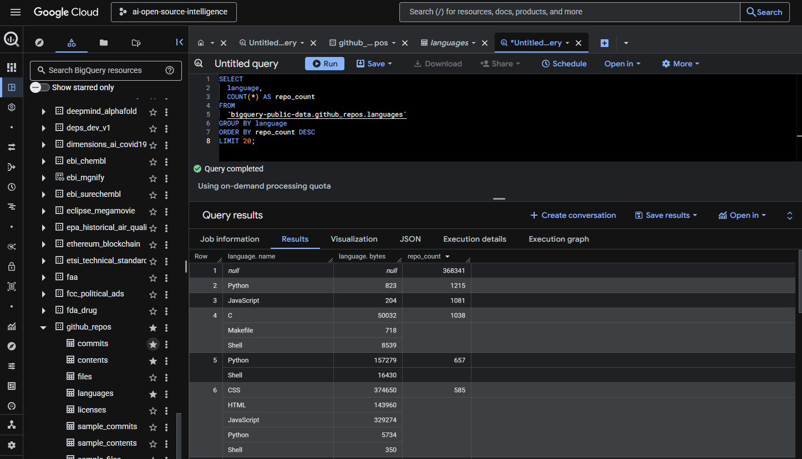

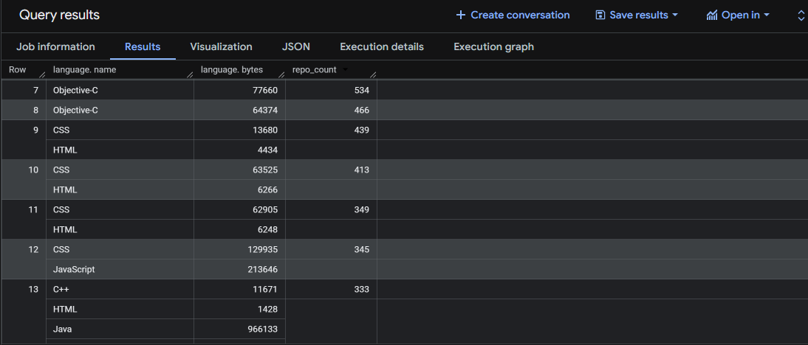
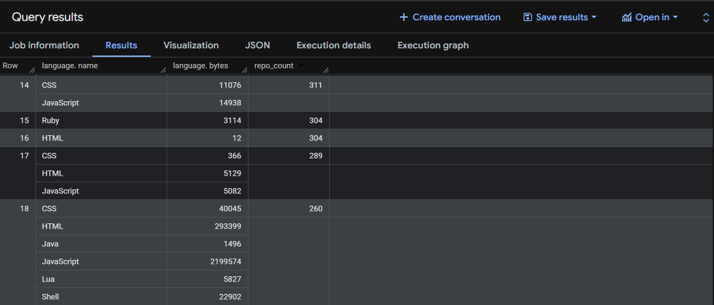
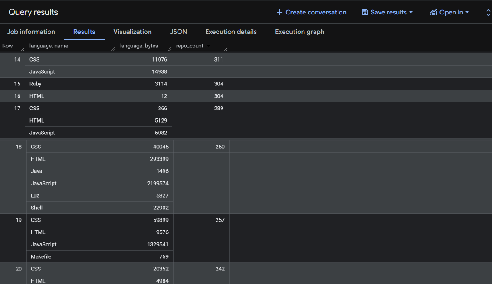

The **contents** table was particularly important for identifying repositories related to Artificial Intelligence. By searching for keywords such as *machine learning*, *deep learning*, *LLM*, and *artificial intelligence*, I was able to detect repositories associated with AI development.

This exploration step helped define the filtering logic used later in the data pipeline to extract AI-related repositories for further analysis.

## Step 3 — Exploring the GitHub Public Dataset

In this step, I explored the **GitHub Repositories Public Dataset** available in BigQuery in order to better understand its structure and identify the tables that would be used in the data pipeline.

The dataset used in this project is:

```
bigquery-public-data.github_repos
```

Before building the transformation pipeline, I performed several exploratory queries to understand the schema and the relationships between tables.

The following tables were analyzed:

* `languages`
* `commits`
* `contents`
* `files`

These tables contain valuable information about **repository metadata, programming languages, source files, and development activity across millions of open-source projects**.

This exploration phase helped me determine how to **identify Artificial Intelligence related repositories** and how to structure the transformation logic that will later populate the data warehouse.

---

## Step 4 — Identifying AI-Related Repositories

In this step, I focused on identifying repositories related to **Artificial Intelligence technologies** in order to narrow the scope of the analysis.

Since the GitHub public dataset contains millions of repositories across many domains, it was necessary to apply a filtering strategy to isolate projects specifically associated with AI development.

To achieve this, I analyzed the repository file paths stored in the **`files`** table and searched for keywords commonly associated with AI-related technologies. The filtering logic was implemented using regular expressions to improve accuracy and reduce false positives.

The following keyword categories were used to detect AI-related repositories:

* **Machine Learning**
* **Deep Learning**
* **Large Language Models (LLMs)**
* **Artificial Intelligence**

The filtering process also limited results to source code file types commonly used in data science and machine learning projects, such as Python and Jupyter Notebook files.


## Programming Language Distribution Across GitHub

To understand which programming languages are most commonly used across repositories, I queried the **languages** table.

Because the `language` field is stored as a **repeated record**, the query uses `UNNEST()` to extract each language entry.

```sql
SELECT
  lang.name AS language,
  COUNT(DISTINCT repo_name) AS repo_count
FROM
  `bigquery-public-data.github_repos.languages`,
  UNNEST(language) AS lang
GROUP BY language
ORDER BY repo_count DESC
LIMIT 20;
```

This query reveals the most frequently used programming languages across GitHub repositories.

**Query Result – Top Programming Languages**

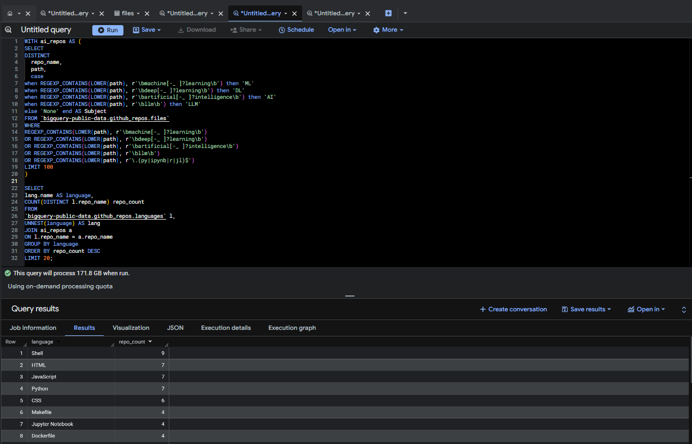

## Detecting AI-related Repositories

To identify repositories related to Artificial Intelligence, I analyzed the **files** table and searched for AI-related keywords within file paths.

```sql
SELECT
DISTINCT
  repo_name,
  path,
  case 
when REGEXP_CONTAINS(LOWER(path), r'\bmachine[-_ ]?learning\b') then 'ML'
when REGEXP_CONTAINS(LOWER(path), r'\bdeep[-_ ]?learning\b') then 'DL'
when REGEXP_CONTAINS(LOWER(path), r'\bartificial[-_ ]?intelligence\b') then 'AI'
when REGEXP_CONTAINS(LOWER(path), r'\bllm\b') then 'LLM'
else 'None' end AS Subject
FROM `bigquery-public-data.github_repos.files`
WHERE
REGEXP_CONTAINS(LOWER(path), r'\bmachine[-_ ]?learning\b')
OR REGEXP_CONTAINS(LOWER(path), r'\bdeep[-_ ]?learning\b')
OR REGEXP_CONTAINS(LOWER(path), r'\bartificial[-_ ]?intelligence\b')
OR REGEXP_CONTAINS(LOWER(path), r'\bllm\b')
OR REGEXP_CONTAINS(LOWER(path), r'\.(py|ipynb|r|jl)$')
LIMIT 100;
```
**Query Result – AI Repo List : **

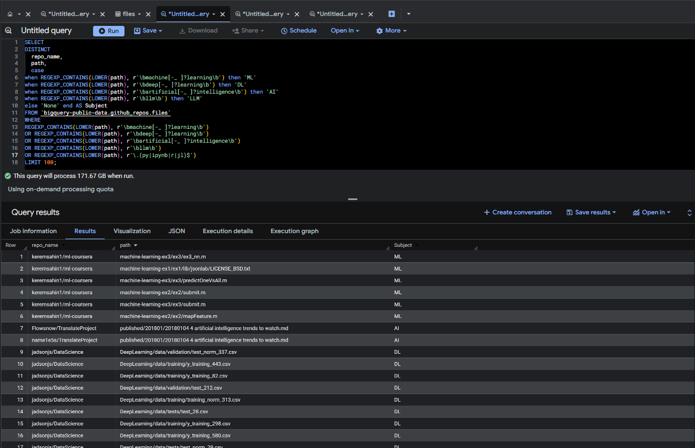

Regular expressions were used instead of simple string matching to reduce false positives and ensure more accurate keyword detection.

```sql
WITH ai_repos AS (
SELECT
DISTINCT
  repo_name,
  path,
  case 
when REGEXP_CONTAINS(LOWER(path), r'\bmachine[-_ ]?learning\b') then 'ML'
when REGEXP_CONTAINS(LOWER(path), r'\bdeep[-_ ]?learning\b') then 'DL'
when REGEXP_CONTAINS(LOWER(path), r'\bartificial[-_ ]?intelligence\b') then 'AI'
when REGEXP_CONTAINS(LOWER(path), r'\bllm\b') then 'LLM'
else 'None' end AS Subject
FROM `bigquery-public-data.github_repos.files`
WHERE
REGEXP_CONTAINS(LOWER(path), r'\bmachine[-_ ]?learning\b')
OR REGEXP_CONTAINS(LOWER(path), r'\bdeep[-_ ]?learning\b')
OR REGEXP_CONTAINS(LOWER(path), r'\bartificial[-_ ]?intelligence\b')
OR REGEXP_CONTAINS(LOWER(path), r'\bllm\b')
OR REGEXP_CONTAINS(LOWER(path), r'\.(py|ipynb|r|jl)$')
LIMIT 100
)

SELECT
lang.name AS language,
COUNT(DISTINCT l.repo_name) repo_count
FROM
`bigquery-public-data.github_repos.languages` l,
UNNEST(language) AS lang
JOIN ai_repos a
ON l.repo_name = a.repo_name
GROUP BY language
ORDER BY repo_count DESC
LIMIT 20;
```

This query counts the number of repositories that contain AI-related keywords within their source files.

**Query Result – Total AI Repositories Count**


---

## Programming Languages Used in AI Repositories

After identifying AI-related repositories, I analyzed which programming languages are most commonly used in those projects.

```sql
WITH ai_repos AS (
SELECT
DISTINCT
  repo_name,
  path,
  case 
when REGEXP_CONTAINS(LOWER(path), r'\bmachine[-_ ]?learning\b') then 'ML'
when REGEXP_CONTAINS(LOWER(path), r'\bdeep[-_ ]?learning\b') then 'DL'
when REGEXP_CONTAINS(LOWER(path), r'\bartificial[-_ ]?intelligence\b') then 'AI'
when REGEXP_CONTAINS(LOWER(path), r'\bllm\b') then 'LLM'
else 'None' end AS Subject
FROM `bigquery-public-data.github_repos.files`
WHERE
REGEXP_CONTAINS(LOWER(path), r'\bmachine[-_ ]?learning\b')
OR REGEXP_CONTAINS(LOWER(path), r'\bdeep[-_ ]?learning\b')
OR REGEXP_CONTAINS(LOWER(path), r'\bartificial[-_ ]?intelligence\b')
OR REGEXP_CONTAINS(LOWER(path), r'\bllm\b')
OR REGEXP_CONTAINS(LOWER(path), r'\.(py|ipynb|r|jl)$')
LIMIT 100
)

SELECT
lang.name AS language, 
a.Subject,
COUNT(DISTINCT l.repo_name) repo_count
FROM
`bigquery-public-data.github_repos.languages` l,
UNNEST(language) AS lang
JOIN ai_repos a
ON l.repo_name = a.repo_name
GROUP BY language ,a.Subject
ORDER BY repo_count DESC
LIMIT 20;
```

This analysis reveals which programming languages dominate the **Artificial Intelligence open-source ecosystem**.
 **Query Result – Languages Used in AI Repositories**

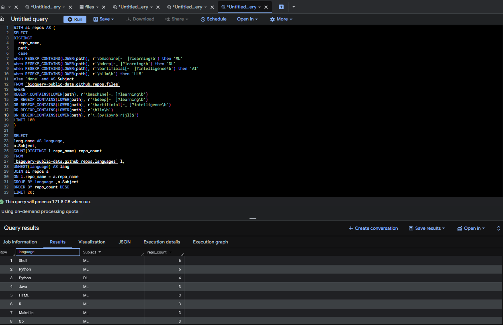
---

Through this exploration process, I was able to:

* Understand the schema of the GitHub public dataset
* Identify the most relevant tables for the analysis
* Define a filtering strategy for detecting AI-related repositories
* Prepare the transformation logic used later in the data pipeline

---

# Step 5 — Data Lake Layer (GCS)

In this step, the filtered AI repository dataset was exported from **BigQuery** to **Google Cloud Storage (GCS)** in order to establish the **Data Lake layer** of the pipeline.

To start the Kestra Orchestra, I started the Kestra server using Docker:

```
docker-compose up -d
```

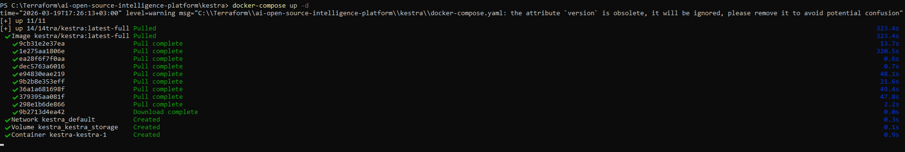

Once the service is running, open the Kestra UI:

```
http://localhost:8080
```

Deploy the pipeline by uploading the Kestra flow file:

```
kestra/flows/ai_pipeline.yaml
```

Then execute the pipeline from the Kestra UI.

After identifying AI-related repositories, the resulting dataset was stored in the data warehouse as the table:

```
ai_open_source_dw.ai_repositories
```

The table was created using the following BigQuery query:

```sql
CREATE OR REPLACE TABLE
`braided-keel-490209-q8.ai_open_source_dw.ai_repositories` AS

WITH ai_repos AS (
SELECT
DISTINCT
  repo_name,
  CASE 
WHEN REGEXP_CONTAINS(LOWER(path), r'\bmachine[-_ ]?learning\b') THEN 'ML'
WHEN REGEXP_CONTAINS(LOWER(path), r'\bdeep[-_ ]?learning\b') THEN 'DL'
WHEN REGEXP_CONTAINS(LOWER(path), r'\bartificial[-_ ]?intelligence\b') 
     OR REGEXP_CONTAINS(LOWER(path), r'\.(py|ipynb|r|jl)$') THEN 'AI'
WHEN REGEXP_CONTAINS(LOWER(path), r'\bllm\b') THEN 'LLM'
ELSE 'None'
END AS subject
FROM `bigquery-public-data.github_repos.files`
WHERE
REGEXP_CONTAINS(LOWER(path), r'\bmachine[-_ ]?learning\b')
OR REGEXP_CONTAINS(LOWER(path), r'\bdeep[-_ ]?learning\b')
OR REGEXP_CONTAINS(LOWER(path), r'\bartificial[-_ ]?intelligence\b')
OR REGEXP_CONTAINS(LOWER(path), r'\bllm\b')
OR REGEXP_CONTAINS(LOWER(path), r'\.(py|ipynb|r|jl)$')
)

SELECT
a.*,
lang.name AS language
FROM
`bigquery-public-data.github_repos.languages` l,
UNNEST(language) AS lang
JOIN ai_repos a
ON LOWER(TRIM(l.repo_name)) = LOWER(TRIM(a.repo_name));
```

To enable scalable storage and downstream processing, the dataset was exported to a **GCS bucket in Parquet format** using the **Kestra orchestration pipeline**.

Instead of manually exporting the table through the BigQuery UI, the export process was automated through a **Kestra task**, which moves the dataset from BigQuery to the data lake layer.

The export configuration was defined as follows:

* Destination bucket: `ai-open-source-lake`
* File format: **Parquet**
* Compression: **Snappy**

Kestra task used for exporting the dataset:

```ai_pipeline.yaml
id: ai-repo-pipeline
namespace: ai.analytics

tasks:
  - id: extract_repos
    type: io.kestra.plugin.gcp.bigquery.Query
    projectId: braided-keel-490209-q8
    destinationTable: braided-keel-490209-q8.ai_open_source_dw.ai_repositories
    writeDisposition: WRITE_TRUNCATE
    sql: |
      WITH ai_repos AS (
      SELECT DISTINCT
        repo_name,
        CASE 
          WHEN REGEXP_CONTAINS(LOWER(path), r'\bmachine[-_ ]?learning\b') THEN 'ML'
          WHEN REGEXP_CONTAINS(LOWER(path), r'\bdeep[-_ ]?learning\b') THEN 'DL'
          WHEN REGEXP_CONTAINS(LOWER(path), r'\bartificial[-_ ]?intelligence\b') 
               OR REGEXP_CONTAINS(LOWER(path), r'\.(py|ipynb|r|jl)$') THEN 'AI'
          WHEN REGEXP_CONTAINS(LOWER(path), r'\bllm\b') THEN 'LLM'
          ELSE 'None'
        END AS subject
      FROM `bigquery-public-data.github_repos.files`
      WHERE
        REGEXP_CONTAINS(LOWER(path), r'\bmachine[-_ ]?learning\b')
        OR REGEXP_CONTAINS(LOWER(path), r'\bdeep[-_ ]?learning\b')
        OR REGEXP_CONTAINS(LOWER(path), r'\bartificial[-_ ]?intelligence\b')
        OR REGEXP_CONTAINS(LOWER(path), r'\bllm\b')
        OR REGEXP_CONTAINS(LOWER(path), r'\.(py|ipynb|r|jl)$')
      )

      SELECT
        a.repo_name,
        a.subject,
        lang.name AS language
      FROM `bigquery-public-data.github_repos.languages` l,
      UNNEST(language) AS lang
      JOIN ai_repos a
      ON LOWER(TRIM(l.repo_name)) = LOWER(TRIM(a.repo_name))

  - id: export_ai_repositories_to_gcs
    type: io.kestra.plugin.gcp.bigquery.Query
    projectId: braided-keel-490209-q8
    sql: |
      EXPORT DATA OPTIONS(
        uri='gs://ai-open-source-lake/ai_repositories-*.parquet',
        format='PARQUET',
        overwrite=true
      ) AS
      SELECT * 
      FROM `braided-keel-490209-q8.ai_open_source_dw.ai_repositories`
```
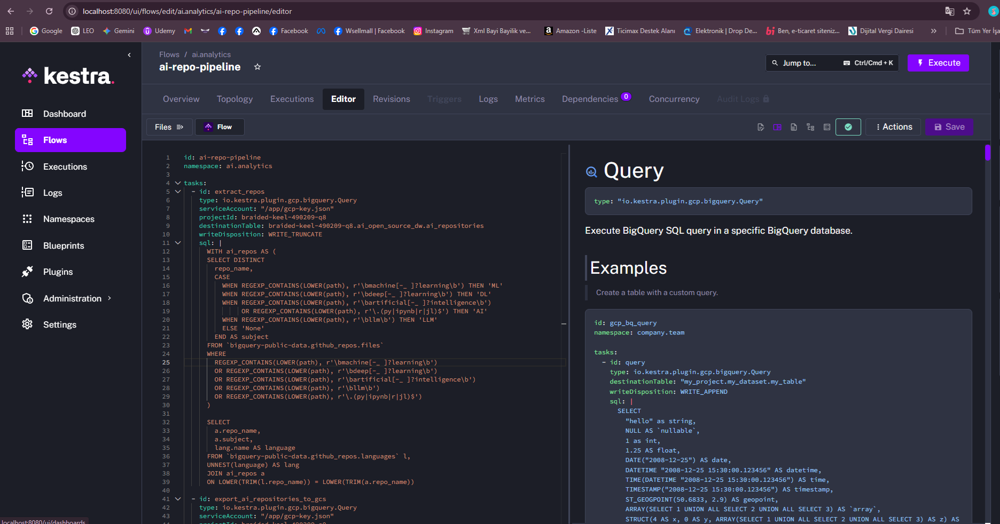

The resulting dataset was stored in the data lake under the following path:

```
gs://ai-open-source-lake/ai_repositories.parquet
```
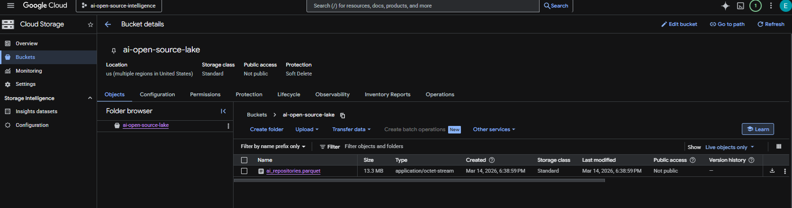

This step establishes the **Data Lake layer** of the pipeline, ensuring that the raw AI repository dataset is stored in a scalable and reusable storage system before further transformation and analytics processing.

---
## Step 6 — Data Transformation Pipeline with dbt

After loading the filtered AI repository dataset into **BigQuery**, I implemented a transformation layer using **dbt (Data Build Tool)** to build a modular analytics pipeline.

The goal of this step was to transform the raw repository data into structured analytical tables that can be used for exploration and downstream analytics.

dbt allows defining transformation logic as modular SQL models with version control and dependency management.

---

#  Transformation Pipeline

The dbt pipeline performs the following transformations:

### 1 Read Raw Repository Data

The raw AI repository dataset is stored in **BigQuery** after the ingestion pipeline.

dbt reads the raw table and prepares it for transformation.

---

### 2 Staging Layer

A staging model was created to standardize the repository dataset.

Model:

```
stg_ai_repositories
```

Purpose:

* Normalize raw repository fields
* Prepare clean data for analytics models
* Create a consistent staging layer

---

### 3 Analytics Layer

An analytics model aggregates repositories by programming language.

Model:

```
ai_repo_languages
```

This model produces an analytical table that shows the distribution of AI repositories by programming language.

---

#  Resulting BigQuery Tables

After running dbt, the following tables are created in the data warehouse:

```
braided-keel-490209-q8
   └── ai_open_source_dw
        ├── stg_ai_repositories
        ├── ai_repo_languages
        └── ai_repo_ai_type.sql
```

Pipeline flow:

```
Raw Data → Staging Model → Analytics Model
```

---

# Why dbt?

Using **dbt** provides several advantages:

* Version-controlled SQL transformations
* Modular data models
* Dependency-aware pipelines
* Reproducible analytics workflows

This transformation layer turns the raw repository dataset into **structured analytics-ready tables inside BigQuery**.

---

# Running the dbt Pipeline

The dbt models are executed using:

```bash
dbt debug
dbt run
```

`dbt debug` verifies the connection to BigQuery.

`dbt run` executes the transformation models and materializes them as tables inside the warehouse.

---

# dbt Execution Screenshots

### dbt Debug Result

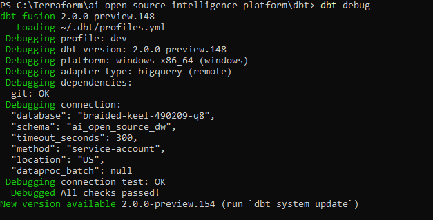

---

### dbt Run Result

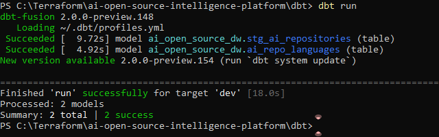
---

# Outcome

This step successfully introduced an **Analytics Engineering layer** into the project using dbt.

The raw AI repository dataset is now transformed into structured analytical tables that enable exploration of the AI ecosystem by programming language.

## Step 7 — Data Visualization with Power BI

In the final stage of the project, I developed an interactive analytics dashboard using Power BI to visualize the insights derived from the data pipeline.

The dashboard connects directly to the analytical tables stored in BigQuery, which were generated through the dbt transformation layer. By integrating Power BI with the data warehouse, I was able to build a visual exploration layer that enables intuitive analysis of the global open-source AI ecosystem.

The dashboard provides a high-level overview of trends in AI-related open-source repositories and allows users to quickly identify patterns across different dimensions of the dataset.

Key Visualizations

The Power BI dashboard includes the following visual components:

* Programming Language Distribution – Highlights the most commonly used programming languages in AI-related repositories, providing insight into the dominant technologies within the AI ecosystem.

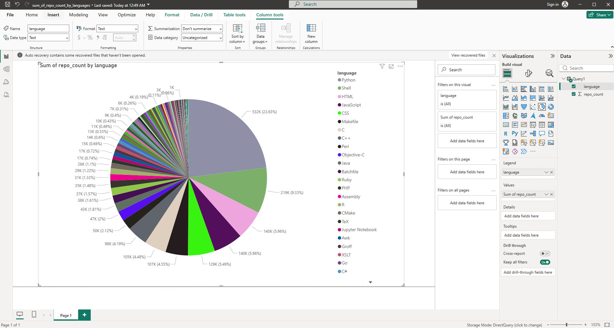

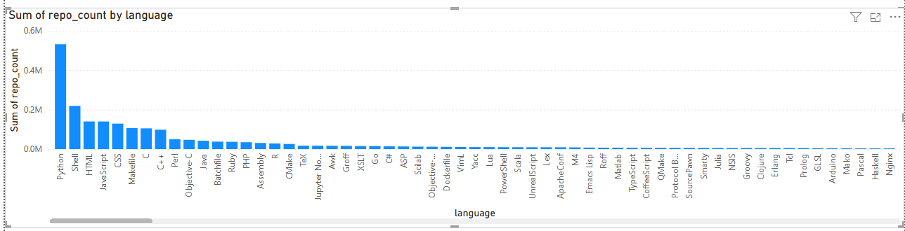

* AI Type Distribution – Visualizes the distribution of AI project topics and subject areas, helping to understand which AI domains (e.g., machine learning, deep learning, computer vision) are most actively developed in the open-source community.

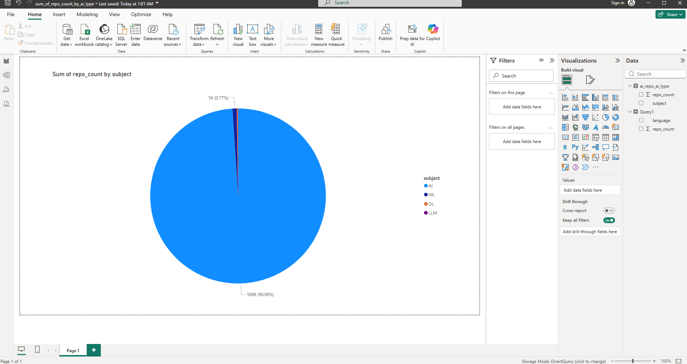

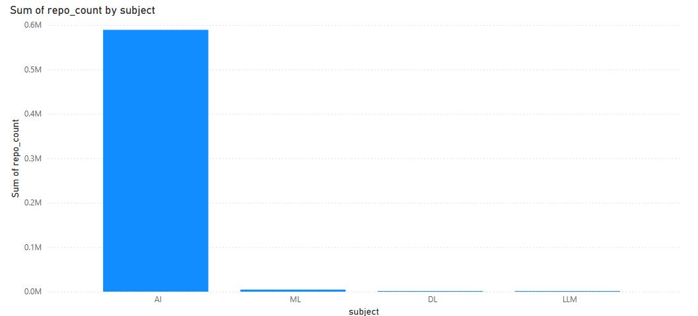

By combining the data engineering pipeline (Terraform, GCS, BigQuery, dbt) with a visual analytics layer in Power BI, this step transforms the processed data into an interactive decision-support dashboard that enables exploration of trends within the global AI development landscape.
